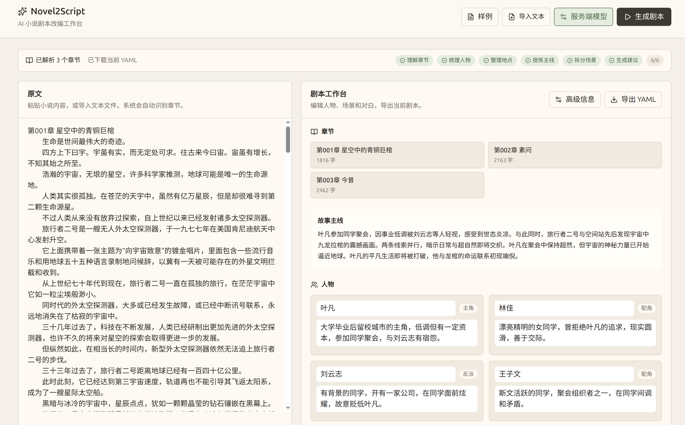

# Novel2Script

AI 小说转剧本工具。项目面向小说作者，目标是把小说文本转换为可编辑、可继续打磨的 YAML 结构化剧本初稿；竞赛 Demo 使用 3 个章节以上的小说样例证明多章节处理能力。

## Demo 视频

- [点击查看 Demo 视频](assets/demo.mp4)

## YAML Schema

剧本输出契约位于 [`schemas/script.schema.json`](schemas/script.schema.json)，字段设计原因见 [`docs/YAML_Schema设计说明.md`](docs/YAML_Schema设计说明.md)。

## 示例输入与输出

- 原创示例：[`examples/sample-novel.md`](examples/sample-novel.md) → [`examples/output-script.yaml`](examples/output-script.yaml)
- 3+ 章节示例：[`examples/zhe-tian-chapter-1-3.md`](examples/zhe-tian-chapter-1-3.md) → [`examples/zhe-tian-output.yaml`](examples/zhe-tian-output.yaml)（辰东《遮天》前三章，仅作演示）

示例文件说明见 [`examples/README.md`](examples/README.md)。

## 工作台截图



## 快速开始

```bash
npm install
npm run dev
```

浏览器访问：

```text
http://localhost:3000
```

## 常用命令

| 命令                | 说明                     |
| ------------------- | ------------------------ |
| `npm run dev`       | 启动本地开发服务器       |
| `npm run build`     | 构建生产版本             |
| `npm run start`     | 启动生产服务器           |
| `npm run lint`      | 运行 ESLint              |
| `npm run typecheck` | 运行 TypeScript 类型检查 |
| `npm test`          | 运行 Vitest 测试         |

## 关键目录

```text
src/app/                 # Next.js App Router 页面与 API（含 /api/generate、/api/generate/stream、/api/validate）
src/components/          # 工作台 UI 组件
src/lib/chapters/        # 章节解析与输入校验
src/lib/ai/              # AI Provider 接口、Mock Provider 和 Pipeline 编排
src/lib/validation/      # YAML 校验、Schema 校验和质量评分
schemas/                 # 剧本 YAML Schema
examples/                # 小说输入样例和 YAML 输出样例
docs/                    # 竞赛文档、开发计划、技术选型和项目状态
```

## 输入规则

当前章节解析支持：

- `第1章 标题`
- `第一章 标题`
- `Chapter 1 Title`
- Markdown 标题形式，例如 `## 第一章 标题`

产品允许识别到 1 个及以上章节时生成试用初稿。竞赛最终 Demo 和示例数据应使用 3 个及以上章节，以证明赛题要求的多章节处理能力。少于 3 章时，质量评分中的“竞赛 Demo 章节数量 ≥ 3”会提示不满足最终演示建议，但 Schema 结构校验仍可通过。

页面支持两种文本输入方式：

- 直接粘贴小说文本。
- 上传 `.txt`、`.md`、`.markdown` 文本文件。

## Provider 配置

生成 Pipeline 默认使用 Mock Provider（固定样例输出，无需 API Key）。

配置以下环境变量后可切换为真实 LLM 生成：

```bash
cp .env.example .env
# 编辑 .env 填入：
OPENAI_API_KEY=sk-...        # 必填
OPENAI_BASE_URL=https://opencode.ai/zen/go/v1
OPENAI_MODEL=deepseek-v4-flash
```

## 架构与 Pipeline

整体采用 **输入解析 → 多阶段 AI Pipeline → Schema 校验 → 可编辑工作台** 的闭环架构，由四层组成：

**1. 输入层**：章节解析模块覆盖中文 `第N章` / 汉字数字 / `Chapter N` / Markdown 标题等多种格式，文件上传自动识别 UTF-8 / GB18030 / GBK 编码，降低小说作者的导入摩擦。

**2. AI Pipeline 层（核心闪光点）**：把“小说→剧本”这种一次性大任务拆分为 6 个串行子任务，每一步只解决一个问题，并把上游结构化产物作为下游输入。

```text
章节摘要 → 人物抽取 → 地点抽取 → 剧情梗概 → 场景拆分 → 改编说明
```

- **结构化上下文传递**：场景拆分使用上一步抽取的人物 / 地点列表作为可选实体集合，从源头保证 `scene.characters` 与 `characters[].id` 引用一致。
- **步骤级错误隔离**：任一步失败时下游自动跳过并标记状态，避免单点错误污染整张剧本；同时返回完整 step 日志便于排查。
- **结果规范化兜底**：`normalizeScenes` 会过滤无效角色引用、回退到对白说话人或首位角色，确保即使模型输出漂移也能产出合规 YAML。
- **真实 SSE 流式反馈**：每个步骤的开始 / 完成 / 错误状态实时推送到前端，用户能看到 AI 在做什么，而不是面对一个加载圈。

**3. Provider 抽象层**：`GenerationProvider` 接口将 Pipeline 与具体模型解耦，内置 `MockProvider`（零成本演示）和 `OpenAIProvider`（OpenAI 兼容协议），切换无需改动业务代码；前端配置面板支持会话级 API Key / Base URL / Model 覆盖，不需重启服务。

**4. 校验与质量层**：

- AJV (JSON Schema draft 2020-12) 做结构校验 + 自研业务规则校验（引用一致性、章节覆盖率）。
- 5 维质量评分面板（赛题合规性、结构完整度、可编辑性、引用一致性、章节覆盖度），让作者直观判断初稿是否可用。
- 工作台支持人物、场景、beat 的直接编辑，YAML 实时同步并提示重新校验。

## 原创内容清单

- `schemas/script.schema.json` 剧本 YAML Schema 及 `docs/YAML_Schema设计说明.md` 字段设计说明。
- 原创三章节小说样例《雨夜档案》及其对应的结构化 YAML 剧本样例。
- 上述四层架构与 6 阶段 Pipeline 的全部实现代码，包括 `GenerationProvider` 抽象、`MockProvider`、`OpenAIProvider`、SSE 流式接口、章节解析、Schema 校验、业务规则校验、质量评分模块和工作台前端。
